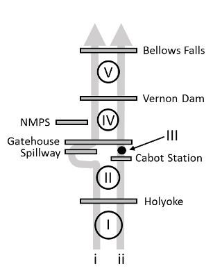

```{r, child="_styles.Rmd"}
```

<br>

<h2 id="multi"><b>Overview of `connecticutRiverModel()`</b></h2>

The purpose of this page is to provide a general overview of the Connecticut River dam passage performance standard model for American shad. If you are looking for examples, please check <a href="examples.html">here</a>.

<h3 id="multi"><b>Habitat definitions</b></h3>

The Connecticut River Model includes American shad habitat from the head of tide upstream to Bellows Falls. Hydro projects that can be assessed include Holyoke Dam, the Turner's Falls project (Cabot Station, Spillway, and Gatehouse), and Vernon Dam. The user can also specify the probability that fish use the Spillway for migration through the Turner's Falls project as a management scenario to determine the sensitivity of population dynamics to passage through Cabot Station and the canal on the east side of the project. The model also incorporates survival probabilities for adults and juveniles at the Northfield Mountain Pumped Power Storage Facility (NMPS).



The river is split into two migratory routes based on passage through the Turner's Falls project. A total of five production units (PUs) are delineated based on dam locations in each route. The spillway route includes PUs I, II, IV, and V, whereas the Cabot Station route includes all five production units. Abundances and carrying capacities are evaluated collectively after the upstream migration model, and all fish move downstream through the Cabot Station route as indicated by fishery managers in this system. The amount of habitat in each production unit is parameterized as 'surface hectares', and the circles in the diagram above are log-proportional to the amount of habitat. The only exception is in PU III (the canal), because it is not considered in production due to seasonal operations, suitability for spawning, and survival of fish that remain.

Carrying capacity in the Connecticut River is based on number of adult spawners per unit surface area of habitat, an approach that is widely used for New England Rivers, but that is also highly uncertain. As in other applications, we assume a carrying capacity of about 100 fish per acre (or 200 fish per ha). Because of the uncertainty associated with these values here and elsewhere, this value is actually drawn from a distribution of values so sensitivity to assumptions can be assessed.

<h3 id="multi"><b>Environmental data</b></h3>

Historical temperature data have been collected from various locations in the Connecticut River watershed. Briefly, these sources include: 1) the U.S. Geological Survey (USGS) gauge in Stratford, NH (`shadia::tempD()`), and 2) temperature data from Turner's Falls provided by the USGS S.O. Conte Anadromous Fish Lab (`shadia::tempData_connecticut()`). Additionally, `connecticutRiverModel()` is the only model that currently includes daily, in-river climate projections for RCP4.5 and RCP8.5 climate forcings from the Gulf of Maine Research institute. These data can be used to simulate populations under various `climate` scenarios and explore population responses to climate in isolation or in addition to dam impacts and fishing mortality sources. Any of these data can be used to simulate new annual temperatures through the `simTemperature()` function in `shadia`, for example:

```{r}
# Simulate new temperatures for a single year
  newT <- shadia::simTemperature(shadia::tempData_connecticut)
  plot(newT,
       type='l', lwd = 2, col = 'gray40',
       ylab=expression(paste('Temperature (', degree, 'C)'))
       )
```

See `?shadia::tempD` or `?shadia::tempData_connecticut` in R for more information about historical temperature data sets. Information about forecasted daily river temperatures under climate scenarios can be accessed by running `?shadia::ctr_proj45` and `?shadia::ctr_proj45` in R. Information about simulating new temperatures from existing data can be accessed by typing `?simTemperature()` and running in R.

<h3 id="multi"><b>Biological data</b></h3>

The majority of biological data and behavioral processes in `shadia` are conserved between systems to standardize the approach. Othes are seeded intially and are derived from model observations as emergent patterns thereafter. However, each river system requires some river-specific biological data including maximum age, starting population sizes, and membership in life-history based '`region`s' used to parameterize size at age and marine survival rates from coastal stock assessments.

The maximum age used for simulation in the Connecticut River is age 8 based on observed fish ages in recent years. The model is seeded with an initial age-1 abundance of about 2 million fish. Growth and marine survival inputs are parameterized using estimates for `Northern iteroparous` populations from Atlantic States Marine Fisheries Commission (ASMFC) 2020 American shad stock assessment. Growth and mortality are both projected from parameters of a von Bertalanffy growth function (VBGF) that includes effects of sea surface temperature on parameters L~$\infty$~ and *K*. Marine survival and growth parameters may be projected under either RCP4.5 or RCP8.5 depending on climate scenario selected. If the default (`current`) is selected, then growth parameters will be projected based on RCP8.5 ("business-as-usual") climate scenario. All projected SST are for the Northeast Continental Shelf Large Marine Ecosystem.

<br>