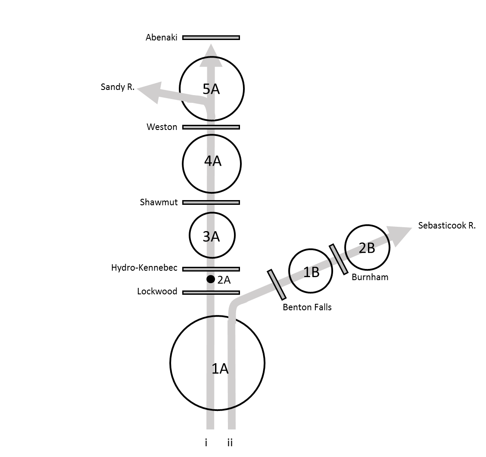

```{r, child="_styles.Rmd"}
```

<br>

<h2 id="multi"><b>Overview of `kennebecRiverModel()`</b></h2>

The purpose of this page is to provide a general overview of the Kennebec River dam passage performance standard model for American shad and blueback herring. If you are looking for examples, please check <a href="examples.html">here</a>.

<h3 id="multi"><b>Habitat definitions</b></h3>

The Kennebec River Model includes American shad and blueback herring habitat from Merrymeeting Bay upstream to Abenaki Dam and the Sandy River in the mainstem, and upstream of Burnham Dam in the Sebasticook River.

Hydro projects that can be assessed include Lockwood Dam, Hydro-Kennebec, Shawmut Dam, and Weston Dam in the mainstem, and Benton Falls and Burnham Dam in the Sebasticook River. The probability that fish use the mainstem or the Sebasticook River is determined stochastically, and is based on proportion of habitat in each of the migration routes.



The river is split into two migratory routes at the confluence of the Kennebec River and its largest tributary, the Sebasticook River. A total of seven production units (PUs) are delineated based on dam locations in each route. The mainstem route includes PUs 1A, 2A, 3A, 4A, and 5A. The Sebasticook River route includes PUs 1A, 1B, and 2B. Abundances and carrying capacities are evaluated collectively in any shared PUs after the upstream migration model runs each year. The amount of habitat in each production unit is parameterized as 'shad production', and the circles in the diagram above are log-proportional to the amount of habitat. The only exception is in PU 2A, because there is no suitable spawning habitat between Lockwood Dam and Hydro-Kennebec.

Carrying capacity in the Kennebec River is based on number of adult spawners per unit surface area of habitat, an approach that is widely used for New England Rivers, but that is also highly uncertain. As in other applications, we assume a carrying capacity of about 100 fish per acre (or 200 fish per ha). Because of the uncertainty associated with these values here and elsewhere, this value is actually drawn from a distribution of values so sensitivity to assumptions can be assessed.

<h3 id="multi"><b>Environmental data</b></h3>

Historical temperature data are compiled from various locations in the Kennebec River watershed 2009-2018 by the Maine Department of Marine Resources. Briefly, these sources include a total of 8 monitoring sites throughout the watershed. These data are used to simulate new annual temperatures using the `simTemperature()` function in `shadia`, for example:

```{r}
# Simulate new temperatures for a single year
  newT <- shadia::simTemperature(shadia::tempData_kennebec)
  plot(newT,
       type='l', lwd = 2, col = 'gray40',
       ylab=expression(paste('Temperature (', degree, 'C)'))
       )
```

See `?shadia::tempData_kennebec` in R for more information about the historical temperature data set for this system. Information about simulating new temperatures from existing data can be accessed by typing `?simTemperature` and running in R.

<h3 id="multi"><b>Biological data</b></h3>

<h4 id="multi"><em>American shad</em></h4>
The majority of biological data and behavioral processes in `shadia` are conserved between systems to standardize the approach. Othes are seeded intially and are derived from model observations as emergent patterns thereafter. However, each river system requires some river-specific biological data including maximum age, starting population sizes, and membership in life-history based '`region`s' used to parameterize size at age and marine survival rates from coastal stock assessments.

The maximum age used for simulation in the Kennebec River is age 9 based on observed fish ages in other New England Rivers. The model is seeded with an initial age-1 abundance of about 0.2 million fish. Growth and marine survival inputs are parameterized using estimates for "Northern iteroparous" populations from Atlantic States Marine Fisheries Commission (ASMFC) 2020 American shad stock assessment. Growth and mortality are both projected from parameters of a von Bertalanffy growth function (VBGF) that includes effects of sea surface temperature on parameters *L*~$\infty$~ and *K*. Marine survival and growth parameters are projected under RCP8.5 for this system using SST from the Northeast Continental Shelf Large Marine Ecosystem.

<h2 id="multi"><em>Blueback herring</em></h2>
All species-specific biological inputs for blueback herring in the Kennebec River model are identical to those used in the <a href="about_mohawkHudson.html">Mohawk-Hudson River model</a> for now. We are working to update these inputs for each river with regional fish biologists and managers (optimistically hopeful ETA for system-specific data is December 31, 2020).

<br>
