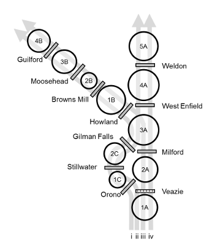

```{r, child="_styles.Rmd"}
```

<br>

<h2 id="multi"><b>Overview of `penobscotRiverModel()`</b></h2>

The purpose of this page is to provide a general overview of the Penobscot River dam passage performance standard model for American shad. If you are looking for examples, please check <a href="examples.html">here</a>.

<h3 id="multi"><b>Habitat definitions</b></h3>

The Penobscot River Model includes American shad habitat from the Penobscot River estuary upstream to Abbot, ME in the Piscataquis River and upstream of Weldon (Mattaceunk) Dam in the mainstem Penobscot River. The model currently incorporates facets of upstream and downstream migration through an alternative migration route, the Stillwater Branch, in the lower main-stem of the river. Fish attempting to use the Stillwater Branch are collected at Orono Dam, and "trucked" upstream of Milford Dam in the model. Upstream and downstream probabilities for using the Stillwater Branch for migration are randomly drawn from distributions based on migration of other species in the river. Probability of using the Piscataquis River is based on proportion of habitat upstream of Howland and West Enfield dams.

Hydro projects that can be assessed for upstream passage in this model include Milford, West Enfield, and Weldon dams in the main-stem, and Howland, Browns Mill, Moosehead, and Guilford dams in the Piscataquis River. Downstream passage can be assessed at each of these dams, as well as Stillwater and Orono dams in the Stillwater Branch. The former site of Veazie Dam is included in the source code for the model for historical comparisons, but is not currently implemented because the dam was removed in 2013.



The river is split into two migratory routes at the confluence of the Stillwater Branch and the main-stem river, and two more routes at the confluence of the Piscataquis and Penobscot rivers. This results in 4 upstream migration routes and 2 downstream migration routes. A total of eleven production units (PUs) are delineated based on dam locations in each route. The stillwater-to-piscataquis route (i) includes PUs 1A, 1C, 2C, 3A, 1B, 2B, 3B, and 4B. The stillwater-to-mainstem route (ii) includes PUs 1A, 1C, 2C, 3A, 4A, and 5A. The mainstem-to-piscataquis route (iii) includes PUs 1A, 2A, 3A,  1B, 2B, 3B, and 4B. The mainstem-to-mainstem route (iv) includes PUs 1A, 2A, 3A, 4A, and 5A. Abundances and carrying capacities are evaluated collectively in any shared PUs after the upstream migration model runs each year. The amount of habitat in each production unit is parameterized as 'shad production', and the circles in the diagram above are log-proportional to production.

Carrying capacity in the Penobscot River is based on number of adult spawners per unit surface area of habitat, an approach that is widely used for New England Rivers, but that is also highly uncertain. As in other applications, we assume a carrying capacity of about 100 fish per acre (or 200 fish per ha). Because of the uncertainty associated with these values here and elsewhere, this value is actually drawn from a distribution of values so sensitivity to assumptions can be assessed.

<h3 id="multi"><b>Environmental data</b></h3>

Historical temperature data are compiled from the U.S. Geological gauge at Eddington, ME (ID 01036390) 1980-2016. These data are used to simulate new annual temperatures using the `simTemperature()` function in `shadia`, for example:

```{r}
# Simulate new temperatures for a single year
  newT <- shadia::simTemperature(shadia::tempData)
  plot(newT,
       type='l', lwd = 2, col = 'gray40',
       ylab=expression(paste('Temperature (', degree, 'C)'))
       )
```

See `?shadia::tempData` in R for more information about the historical temperature data set for this system. Information about simulating new temperatures from existing data can be accessed by typing `?shadia::simTemperature` and running in R.

<h3 id="multi"><b>Biological data</b></h3>

The majority of biological data and behavioral processes in `shadia` are conserved between systems to standardize the approach. Othes are seeded intially and are derived from model observations as emergent patterns thereafter (e.g. proportion of repeat spawners). However, each river system requires some river-specific biological data including maximum age, starting population sizes, and membership in life-history based '`region`s' used to parameterize size at age and marine survival rates from growth parameters estimated as part of stock assessment.

The maximum age used for simulation in the Penobscot River is age 9 based on empirical data from the Penobscot River. The model is seeded with an initial age-1 abundance of about 0.2 million fish. Growth and marine survival inputs are parameterized using estimates for "northern iteroparous" populations from Atlantic States Marine Fisheries Commission (ASMFC) 2020 American shad stock assessment. Growth and mortality are both projected from parameters of a von Bertalanffy growth function (VBGF) that includes effects of sea surface temperature on parameters *L*~$\infty$~ and *K*. Marine survival and growth parameters are projected under RCP8.5 for this system using SST from the Northeast Continental Shelf Large Marine Ecosystem.

<br>
