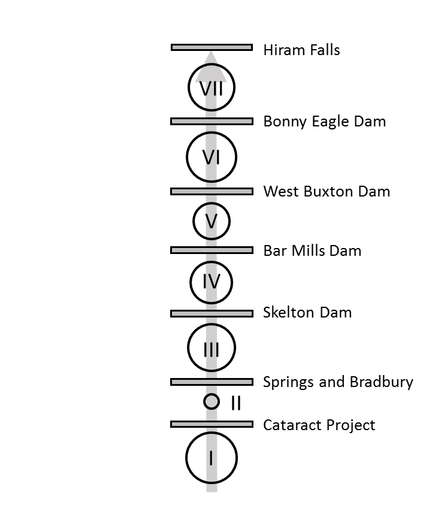

```{r, child="_styles.Rmd"}
```

<br>

<h2 id="multi"><b>Overview of `sacoRiverModel()`</b></h2>

The purpose of this page is to provide a general overview of the Saco River dam passage performance standard model for American shad and blueback herring. If you are looking for examples, please check <a href="examples.html">here</a>.

<h3 id="multi"><b>Habitat definitions</b></h3>

The Saco River Model includes American shad and blueback herring habitat from the mouth of the Saco River to Hiram Falls Dam in Maine, USA. The model currently incorporates a single upstream and a single downstream migration route, but we have talked about adding the Osipee and Little Osipee rivers with resource managers.

Hydro projects that can be assessed for upstream passage in this model include the Cataract Project, Springs and Bradbury, Skelton, Bar Mills, and Bonny Eagle dams.



Migration is currently modeled using a single migratory route, with a total of seven production units (I, II, ..., VII) The amount of habitat in each production unit is parameterized as 'shad production', and the circles in the diagram above are log-proportional to production.

Carrying capacity in the Saco River is based on number of adult spawners per unit surface area of habitat, an approach that is widely used for New England Rivers, but that is also highly uncertain. As in other applications, we assume a carrying capacity of about 100 fish per acre (or 200 fish per ha). Because of the uncertainty associated with these values here and elsewhere, this value is actually drawn from a distribution of values so sensitivity to assumptions can be assessed.

<h3 id="multi"><b>Environmental data</b></h3>

Historical temperature data are compiled from the U.S. Geological gauge at Bartlett, NH (ID 010642505) 2009-2019 in addition to stream temperature data from the SHEDS database. These data are used to simulate new daily temperatures using the `simTemperature()` function in `shadia`, for example:

```{r, warning = FALSE, message = FALSE}
library(shadia)
library(ggplot2)

# Simulate new temperatures for a single year
  newT <- simTemperature(setUpTemperatureData(river = "saco"))

# Plot the result
  ggplot(newT, aes(x = day, y = val)) +
    geom_line() +
    ylab(expression(paste('Temperature (', degree, 'C)'))) +
    xlab("Day of year")
```

See `?shadia::tempData_saco` in R for more information about the historical temperature data set for this system. Information about simulating new temperatures from existing data can be accessed by typing `?shadia::simTemperature` and running in R.

<h3 id="multi"><b>Biological data</b></h3>

<h4 id="multi"><em>American shad</em></h4>
The majority of biological data and behavioral processes in `shadia` are conserved between systems to standardize the approach. Othes are seeded intially and are derived from model observations as emergent patterns thereafter (e.g. proportion of repeat spawners). However, each river system requires some river-specific biological data including maximum age, starting population sizes, and membership in life-history based '`region`s' used to parameterize size at age and marine survival rates from growth parameters estimated as part of stock assessment.

The maximum age used for simulation in the Saco River is age 9 based on empirical data from other New England Rivers. The model is seeded with an initial age-1 abundance of about 0.2 million fish. Growth and marine survival inputs are parameterized using estimates for "northern iteroparous" populations from Atlantic States Marine Fisheries Commission (ASMFC) 2020 American shad stock assessment. Growth and mortality are both projected from parameters of a von Bertalanffy growth function (VBGF) that includes effects of sea surface temperature on parameters *L*~$\infty$~ and *K*. Marine survival and growth parameters are projected under RCP8.5 for this system using SST from the Northeast Continental Shelf Large Marine Ecosystem.

<h4 id="multi"><em>Blueback herring</em></h4>
All species-specific biological inputs for blueback herring in the Saco River model are identical to those used in the <a href="about_kennebec.html">Kennebec River model</a> for now. We are working to update these inputs for each river with regional fish biologists and managers.
<br>
