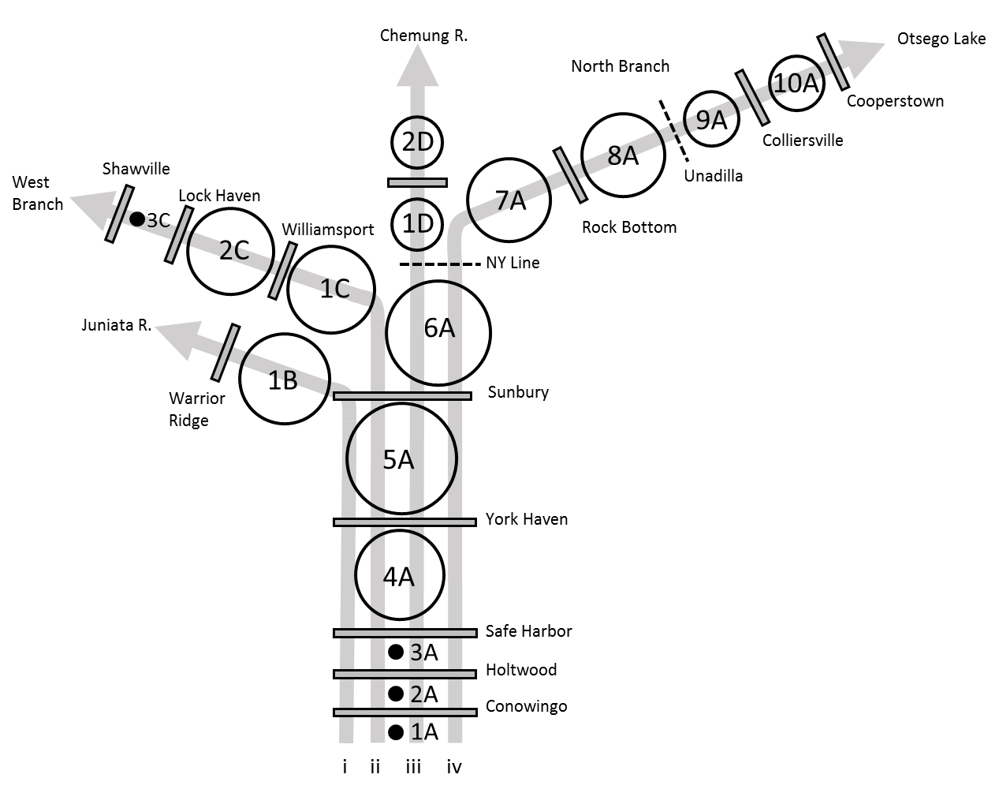

```{r, child="_styles.Rmd"}
```

<br>

<h2 id="multi"><b>Overview of `susquehannaRiverModel()`</b></h2>

The purpose of this page is to provide a general overview of the Susquehanna River dam passage performance standard model for American shad and blueback herring. If you are looking for examples, please check <a href="examples.html">here</a>.

<h3 id="multi"><b>Habitat definitions</b></h3>

The Susquehanna River Model includes American shad and blueback herring habitat from the Mouth of the Susquehanna River at the Chesapeake Bay. The model currently incorporates upstream passage into the Juniata River (i), the West Branch (ii), the Chemung River (iii), and the North Branch of the Susquehanna River (iv). Upstream and downstream probabilities for using the Stillwater Branch for migration are randomly drawn from distributions based on migration of other species in the river. Probability of using the Piscataquis River is based on proportion of habitat upstream of Howland and West Enfield dams.

Hydro projects that can be assessed for upstream passage in this model include: 



The river is split into four migratory routes for three tributaries (i-iii) and the main-stem (iv). A total of sixteen production units (PUs) are delineated based on dam locations in each route. The Juniata route (i) also includes PU 1B, the West Branch route (ii) includes PUs 6A, and 1C through 3C, the Chemung River route (iii) includes PUs 6A, 1D, and 2D, and the North Branch (iv) includes PUs 1A through 10A. Abundances and carrying capacities are evaluated collectively in any shared PUs after the upstream migration model runs each year. The amount of habitat in each production unit is parameterized as 'shad production', and the circles in the diagram above are log-proportional to production.

Carrying capacity in the Susquehanna River is based on number of adult spawners per unit surface area of habitat, an approach that is widely used for New England Rivers, but that is also highly uncertain. As in other applications, we assume a carrying capacity of about 100 fish per acre (or 200 fish per ha). Because of the uncertainty associated with these values here and elsewhere, this value is actually drawn from a distribution of values so sensitivity to assumptions can be assessed.

<h3 id="multi"><b>Environmental data</b></h3>

Historical temperature data are compiled from the U.S. Geological gauge in Harrisburg, PA (ID 01570500) from 2008 through 2014. These data are used to simulate new annual temperatures using the `simTemperature()` function in `shadia`, for example:

```{r, warning = FALSE, message = FALSE}
library(shadia)
library(ggplot2)

# Simulate new temperatures for a single year
  newT <- simTemperature(setUpTemperatureData(river = "susquehanna"))

# Plot the result
  ggplot(newT, aes(x = day, y = val)) +
    geom_line() +
    ylab(expression(paste('Temperature (', degree, 'C)'))) +
    xlab("Day of year")
```

See `?shadia::tempData_susquehanna` in R for more information about the historical temperature data set for this system. Information about simulating new temperatures from existing data can be accessed by typing `?shadia::simTemperature` and running in R.

<h3 id="multi"><b>Biological data</b></h3>

<h2 id="multi"><em>American shad</em></h2>
The majority of biological data and behavioral processes in `shadia` are conserved between systems to standardize the approach. Othes are seeded intially and are derived from model observations as emergent patterns thereafter (e.g. proportion of repeat spawners). However, each river system requires some river-specific biological data including maximum age, starting population sizes, and membership in life-history based '`region`s' used to parameterize size at age and marine survival rates from growth parameters estimated as part of stock assessment.

The maximum age used for simulation in the Susquehanna River is 11 years based on empirical data from the upper Chesapeake Bay. The model is seeded with an initial age-1 abundance of about 0.2 million fish. Growth and marine survival inputs are parameterized using estimates for "southern iteroparous" populations from Atlantic States Marine Fisheries Commission (ASMFC) 2020 American shad stock assessment. Growth and mortality are both projected from parameters of a von Bertalanffy growth function (VBGF) that includes effects of sea surface temperature on parameters *L*~$\infty$~ and *K*. Marine survival and growth parameters are projected under RCP8.5 for this system using SST from the Northeast Continental Shelf Large Marine Ecosystem.

<h2 id="multi"><em>Blueback herring</em></h2>
All species-specific biological inputs for blueback herring in the Susquehanna River model are identical to those used in the <a href="about_mohawkHudson.html">Mohawk-Hudson River model</a> for now. We are working to update these inputs for each river with regional fish biologists and managers.

<br>
