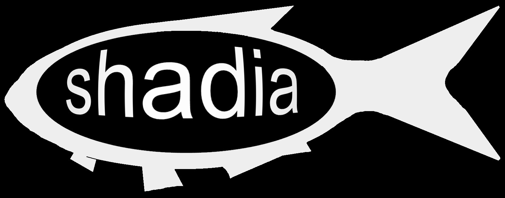

```{r, child="_styles.Rmd"}
```

<h2 id="multi"><b>\'`shadia`\' package for R </b></h2>



This page is dedicated to providing introduction to and documentation for the `shadia` software project. You can find installation instructions, examples, prevous versions, and documentation for computer models and data on this page.

`shadia` is an R package that was designed to run dam passage performance standard models for American shad and other herrings. It contains functions for running computer models that can be used to predict the response of fish populations to different dam passage standards (upstream and downstream fish passage efficiencies, and timeliness of upstream passage). Because this R package is part of ongoing research, we are continuously updating it with new data and models. Please check back often at this page, or at the <a href="https://github.com/danStich/shadia">GitHub repository</a> for issues, and updates. If you find a bug in the software, please report it directly as an <a href="https://github.com/danStich/shadia/issues">issue</a> in the GitHub repository.  

The `shadia` package currently contains life-history based models for American shad and blueback herring in the Connecticut, Kennebec, Merrimack, Mohawk-Hudson, Penobscot, Saco, and Susquehanna rivers, all in the northeast United States. **These models are in various stages of completion** but are provided for transparency in their development and application. **So, please** check with the package maintainer (daniel.stich at oneonta.edu) before using them for management. We are still working to add more river systems, and we are starting to plan models for other herrings along with collaborators throughout the Northeast. If there is a system you would like to see implemented, please post as an <a href="https://github.com/danStich/shadia/issues">issue</a> on the GitHub repository, or contact developers directly.

